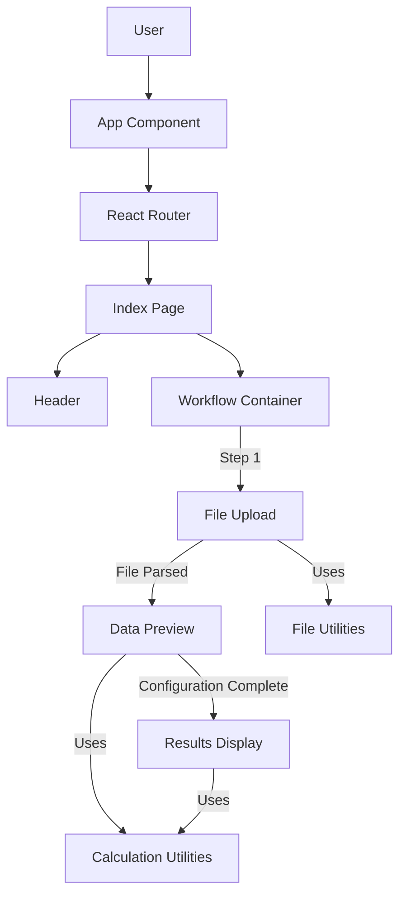
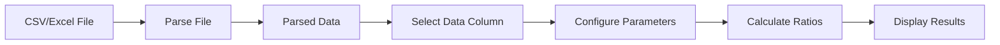

# System Patterns

## Sprint-01 – Accuracy & UX polish (2025-04-18)

This sprint introduces the following new or updated system patterns, which extend or override previous patterns where relevant:

- **Geometric Mean for Annualisation**: All annualised returns now use geometric mean (CAGR) instead of arithmetic mean.
- **Downside Deviation (m-1)**: Downside deviation calculation uses (m-1) denominator for sample standard deviation.
- **Fractional Returns Enforcement**: All calculations require fractional returns; calculations are blocked if portfolioValue is missing and dataFormat is 'absolute'.
- **Rolling Sharpe Statistics**: 30/60/90-day rolling Sharpe ratios are computed and visualized.
- **Plotly Chart Integration**: Rolling Sharpe statistics are visualized using Plotly with Tailwind-themed traces, embedded in a new Accordion on the Results page.
- **Scrollable Data Preview Table**: Data preview table is scrollable (max-h-64, overflow-auto).
- **Footer Row Exclusion**: A toggle allows marking the last row as a footer, which is excluded from calculations and exports.
- **Excel Export Overhaul**: Exports now include live-formula columns, static results, 2 dp formatting, and risk-free cell defaulting to 0 if blank.

## Architecture Overview
The Sharpe Sortino Simplifier follows a client-side single-page application (SPA) architecture built with React and TypeScript. The application is structured to maintain a clear separation of concerns and facilitate component reuse.

### Core Architecture Components



## Key Design Patterns

### State Management
- **Component State**: Used for local UI state (React's useState hook)
- **Prop Drilling**: Used for passing data between parent-child components
- **Stateful Workflow**: Three-step process with state transitions managed by the parent component

### Component Structure
- **Container/Presentation Pattern**: 
  - Index page acts as the container for application state
  - FileUpload, DataPreview, and Results are presentation components receiving props and emitting events
- **Composition**: Complex UI elements composed from smaller, reusable components (Cards, Tables, Charts)

### Data Processing
- **Data Transformation Pipeline**:
  1. File parsing (XLSX/CSV → JSON)
  2. Data validation and cleaning
  3. Column selection and parameter configuration
  4. Calculation
  5. Result formatting and visualization

### Error Handling
- **Toast Notifications**: Used for user feedback and error messages
- **Defensive Coding**: Validation checks before critical operations
- **Graceful Degradation**: Fallback strategies for edge cases

## File Organization

```
src/
├── components/           # Reusable UI components
│   ├── ui/               # shadcn/ui components
│   ├── FileUpload.tsx    # Step 1: File upload component
│   ├── DataPreview.tsx   # Step 2: Data preview component
│   ├── Results.tsx       # Step 3: Results component
│   └── Header.tsx        # Application header
├── pages/                # Page components
│   ├── Index.tsx         # Main application page
│   └── NotFound.tsx      # 404 page
├── utils/                # Utility functions
│   ├── fileUtils.ts      # File parsing and processing
│   └── calculationUtils.ts # Financial calculations
├── hooks/                # Custom React hooks
├── lib/                  # Library configurations
└── App.tsx               # Root component with routing
```

## Data Flow



## Key Technical Implementations

### File Processing
- Uses the `xlsx` library for parsing various file formats
- Handles date detection and formatting for Excel files
- Supports auto-detection of numeric formats (percentages vs. decimals)

### Financial Calculations
- Implements standard finance formulas for Sharpe and Sortino ratios
- Handles edge cases (zero standard deviation, insufficient data points)
- Provides both raw and annualized metrics

### Visualization
- Uses Chart.js through React-ChartJS-2 for distribution histograms
- Custom formatting for different data types (percentage, decimal, absolute) 